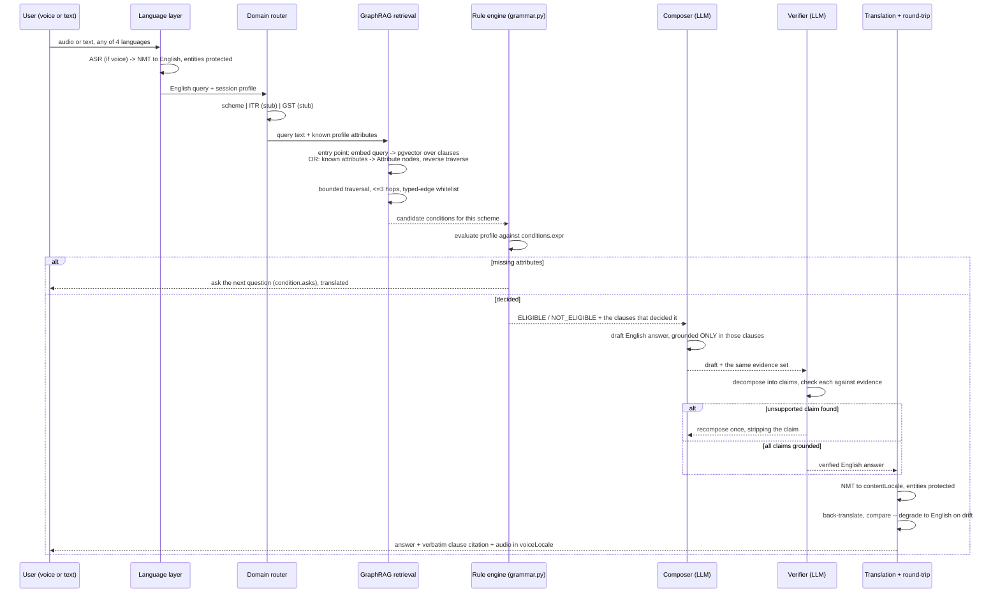

# Phase 2 — Backend, AI agents, and GraphRAG

Phase 1 (`data/scripts/`) produces three committed artifacts per scheme:
`build/rules.v{n}.json`, `build/graph.v{n}.json`, `build/clauses.jsonl`. Phase 2
is the service that serves them. It never reads `scheme.md` directly and never
trusts anything the corpus toolchain hasn't already validated — the backend's
job is to serve verified data, not to re-verify it.

Two things carry over from Phase 1 by design, not by convenience:

1. **`data/scripts/grammar.py` is the rule engine.** It's a restricted-AST
   expression parser, already tested (187 tests), that evaluates
   `profile.attr == value`-style expressions with no `eval()`. The backend
   imports it directly against a live user profile instead of a static
   `scheme.md` — same module, new caller. Do not write a second interpreter.
2. **The graph is a projection of the rule pack, never authored twice** —
   `build.py` already enforces this for the corpus. The backend must not
   let a service-side cache silently diverge from `build/graph.v{n}.json`;
   sync, don't re-derive.

## Basic flow — one request, end to end



The two loops that matter: the rule engine can end the flow early by asking a
question instead of guessing, and the verifier can send a draft back to the
composer instead of letting an unsupported claim through. Both are cheaper to
draw than to describe, and both are the actual point of the architecture.

## Backend layout

```
api/
├── routers/          /chat  /voice  /documents  /health
├── rules/
│   └── engine.py      imports data/scripts/grammar.py -- does not reimplement it
├── graph/
│   ├── sync.py         build/graph.v{n}.json -> Postgres, versioned, idempotent
│   ├── traverse.py      recursive CTEs, hop-capped, typed-edge whitelist
│   └── retrieval.py     hybrid entry point: pgvector seed -> graph traversal
├── agents/
│   ├── router.py        scheme | ITR (stub) | GST (stub)
│   ├── composer.py       drafts from an evidence set, never from memory
│   ├── verifier.py       claim-by-claim check against the same evidence set
│   ├── llm.py             provider abstraction (Gemini / Groq free tier)
│   └── prompts/            versioned files, never inline strings
├── language/           LanguageService, Bhashini provider, protect.py, round-trip
├── db/
│   ├── models.py        graph_nodes, graph_edges, clauses, scheme_versions,
│   │                     sessions (TTL), translation/audio cache
│   └── migrations/
└── main.py
```

## GraphRAG

### Storage

Two tables, loaded by `graph/sync.py` from every scheme's `build/graph.v{n}.json`
— not derived independently, just upserted:

```sql
graph_nodes(id text, scheme text, version int, type text, props jsonb,
            primary key (id, version))
graph_edges(from_id text, predicate text, to_id text, scheme text, version int)
clauses(id text, scheme text, version int, quote text, plain text,
        aliases text[], embedding vector(...), source_url text, page int)
```

`sync.py` is idempotent and keyed on `(scheme, version)`, so an old rule
version stays queryable after a new one ships — the same versioning the
corpus already tracks in git carries through to what's servable.

### The attribute-sharing property, and what it requires

`build_graph()` names attribute nodes `attribute:<name>` with no scheme
prefix. Once a second scheme is synced, an `attribute:age` node from pmfme and
an `attribute:age` node from, say, PM-KISAN **merge into one node** — which is
exactly what the reverse query class below needs ("I have these documents,
what am I eligible for, across every scheme"). It is not automatic, and it is
not free: it only works if `age` means the same thing in both schemes'
authored `tests:` lists. That's a semantic claim, not a naming coincidence.

Concretely, this needs a check that doesn't exist yet: a lightweight
cross-scheme attribute registry (`data/attributes.md` or similar, one line per
shared name with its meaning and unit) plus a `validate.py --all` rule that
flags an attribute name reused across schemes with no registry entry. Add this
before syncing a second scheme, not after — a silent semantic collision here
produces a wrong answer that looks like a working feature.

### Retrieval — two entry points, both bounded

```mermaid
flowchart LR
    subgraph "Query-first (\"am I eligible for X\")"
        Q["free-text query"] --> EMB["embed against clauses.embedding_text<br/>(plain + aliases, never the quote)"]
        EMB --> SEED1["seed: Clause nodes"]
        SEED1 -->|GROUNDED_IN reverse| COND1["Condition"]
        SEED1 -->|FROM| SRC1["SourceDocument"]
    end
    subgraph "Profile-first (\"what can I get\")"
        ATTRS["known profile attributes"] --> SEED2["seed: Attribute nodes"]
        SEED2 -->|BEARS_ON reverse| CLAUSE2["Clause"]
        CLAUSE2 -->|HAS_CLAUSE reverse| SCHEMES2["every Scheme with a matching clause"]
    end
```

Real predicates only, taken from `build_graph()` — no invented edge types:
`HAS_CLAUSE`, `FROM`, `EXCLUDES`, `REQUIRES_DOCUMENT`, `PROVIDES`, `BEARS_ON`,
`REQUIRES`, `GROUNDED_IN`, `TESTS`.

| Question | Traversal |
|---|---|
| Am I eligible for X | `Scheme --REQUIRES--> Condition --GROUNDED_IN--> Clause --FROM--> SourceDocument` |
| What do I need to bring | `Scheme --REQUIRES_DOCUMENT--> Clause` |
| What do I get | `Scheme --PROVIDES--> Clause` |
| Why was I excluded | `Scheme --EXCLUDES--> Clause`, paired with the `Condition` that `GROUNDED_IN`s it |
| I have this document, what applies to me (reverse, cross-scheme) | `Attribute <--BEARS_ON-- Clause <--HAS_CLAUSE-- Scheme`, across every scheme sharing that attribute |

`traverse.py` implements each row as one recursive CTE with a hard 3-hop cap
and a per-query-class predicate whitelist — an untyped traversal on this graph
will happily wander from a `Clause` into an unrelated `Scheme`'s benefit
amount and hand the composer something true but irrelevant, which the
verifier will then pass because it *is* grounded, just not to the question
asked. The whitelist is what keeps relevance and groundedness from being
treated as the same property.

The evidence set handed to the composer and the verifier must be the exact
same object returned by this traversal — never re-fetched separately by
each — or the verifier ends up checking against different evidence than the
composer actually used, which quietly defeats the entire verification step.

## Agents

Five components, each with one job:

1. **NLU / slot-filler** — extracts profile attributes the user *stated about
   themselves* from free text into the typed vocabulary the graph already
   uses (`age`, `annual_income`, ...). Never asserts a fact about a rule,
   only about the person.
2. **Router** — scheme today; ITR and GST return "not yet supported" stubs
   that exercise the same interface so they're a data problem later, not an
   architecture change.
3. **Composer** (LLM) — drafts the English answer from the evidence set the
   graph returned and nothing else. The prompt says this explicitly and says
   what to do when the evidence is thin: ask, don't fill the gap.
4. **Verifier** (LLM) — decomposes the draft into atomic claims; each must
   match either a rule-engine-emitted fact (with its condition id) or an
   entailment match against a clause in the same evidence set (with its
   clause id). Unsupported claims get one recompose pass, then the honest
   "not confident" fallback.
5. **Round-trip translation check** — reuses `LanguageService` from the
   original multilingual design: back-translate the localized answer,
   compare, degrade to English on drift.

The LLM sits in exactly two places that can affect what a user is told
(composer, verifier) and never in the place that decides eligibility. That
split is the whole architecture in one sentence.

## What's buildable this week, against real data

`data/schemes/pmfme/build/graph.v1.json` and `rules.v1.json` already exist and
are committed. The first real milestone isn't a stub — it's:

```bash
python api/graph/sync.py --scheme pmfme     # load the real graph into Postgres
python api/rules/engine.py --scheme pmfme --profile '{"age": 25, ...}'
```

and getting back an actual `ELIGIBLE` / `NOT_ELIGIBLE` / `INSUFFICIENT_INFO`
verdict with real clause citations, before any agent or LLM code is written
at all. The rule engine and the graph don't need the AI layer to be testable
— that's deliberate, and it's the fastest way to find out if `grammar.py`'s
interface needs to change before agent code is built on top of it.
