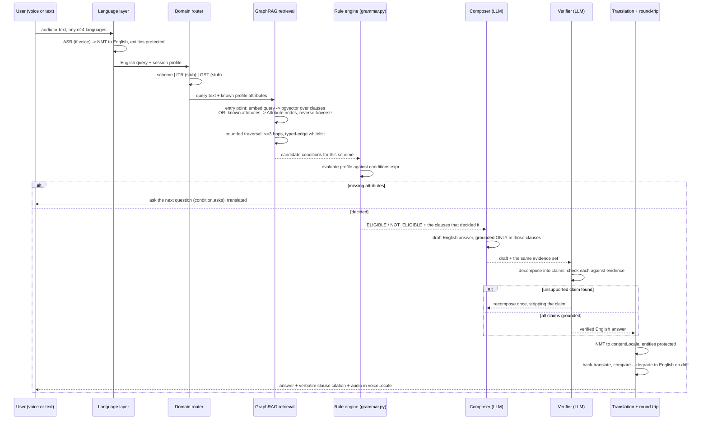

# Phase 2 — Backend, AI agents, and GraphRAG

Phase 1 (`data/scripts/`) produces three committed artifacts per scheme:
`build/rules.v{n}.json`, `build/graph.v{n}.json`, `build/clauses.jsonl`. Phase 2
is the service that serves them. It never reads `scheme.md` directly and never
trusts anything the corpus toolchain hasn't already validated — the backend's
job is to serve verified data, not to re-verify it.

**Provider decision, locked:** the LLM is Groq inference, nothing else. Every
other GraphRAG dependency — embeddings, vector search, graph storage, graph
traversal — runs locally, in-process or in the same Postgres, with no external
API call on that path. §"LLM provider" and §"Embeddings, locally" below cover
what that actually requires; it's more than picking a model name.

Two things carry over from Phase 1 by design, not by convenience:

1. **`data/scripts/grammar.py` is the rule engine.** It's a restricted-AST
   expression parser, already tested (187 tests), that evaluates
   `profile.attr == value`-style expressions with no `eval()`. The backend
   imports it directly against a live user profile instead of a static
   `scheme.md` — same module, new caller. Do not write a second interpreter.
2. **The graph is a projection of the rule pack, never authored twice** —
   `build.py` already enforces this for the corpus. The backend must not
   let a service-side cache silently diverge from `build/graph.v{n}.json`;
   sync, don't re-derive.

## Basic flow — one request, end to end



The two loops that matter: the rule engine can end the flow early by asking a
question instead of guessing, and the verifier can send a draft back to the
composer instead of letting an unsupported claim through. Both are cheaper to
draw than to describe, and both are the actual point of the architecture.

## Backend layout

```
api/
├── routers/          /chat  /voice  /documents  /health
├── rules/
│   └── engine.py      imports data/scripts/grammar.py -- does not reimplement it
├── graph/
│   ├── sync.py         build/graph.v{n}.json -> Postgres, versioned, idempotent
│   ├── traverse.py      recursive CTEs, hop-capped, typed-edge whitelist
│   └── retrieval.py     hybrid entry point: pgvector seed -> graph traversal
├── agents/
│   ├── router.py        scheme | ITR (stub) | GST (stub) -- keyword-based, see below
│   ├── nlu.py             slot-filler, FAST tier
│   ├── composer.py       drafts from an evidence set, never from memory
│   ├── verifier.py       claim-by-claim check against the same evidence set
│   ├── orchestrate.py      compose -> verify -> recompose once -> fallback
│   ├── llm.py             Groq client, two model tiers (below), no other provider
│   └── prompts/            versioned .txt files, never inline strings
├── routers/chat.py     POST /chat, GET /health
├── deps.py               get_llm() -- the seam tests override to avoid real calls
├── main.py                FastAPI app
├── language/           LanguageService, Bhashini provider, protect.py, round-trip
├── embeddings/
│   └── local.py          sentence-transformers, in-process, no network call
├── db/
│   ├── models.py        graph_nodes, graph_edges, clauses, scheme_versions,
│   │                     sessions (TTL), translation/audio cache
│   └── migrations/
└── main.py
```

## LLM provider — Groq, two tiers

Groq's free tier (checked against current published limits, not assumed):
30 requests/minute, a token-per-minute budget that varies 6K–30K by model, and
a daily request cap that varies 1K–14,400 by model<sup>†</sup>. That variance
is the actual design input — a single model choice either wastes quality
budget on cheap calls or burns the request cap on expensive ones. Two tiers,
picked by task, both configured in `llm.py` behind the same interface so
swapping either later is a config change:

| Tier | Model | Used by | Why |
|---|---|---|---|
| Fast | `llama-3.1-8b-instant` | NLU/slot-filler, router | High call volume (every user turn touches these), free-tier limits are generous (14,400 req/day), and the task is extraction, not reasoning — an 8B model is enough to pull `age: 25` out of a sentence. |
| Reasoning | `llama-3.3-70b-versatile` | Composer, verifier | Lower request budget (~1,000/day free tier), but these are the two places an LLM can actually change what a user is told, so quality matters more than throughput here. |

Router and NLU together are maybe 2 calls per turn; composer + verifier are 2
more, only on turns that reach a decision. At that rate the 70B tier's daily
cap is the actual ceiling on how much live demo/dev traffic the free tier
supports — worth watching once real usage starts, and worth the prebaked
answer cache (already planned for TTS/translation) covering the composer's
output too, not just voice.

Groq also offers free Whisper transcription (2,000 requests/day)<sup>†</sup>.
Not adopted here — Indic ASR quality is the specific thing Bhashini is built
for, and swapping in a general-purpose Whisper endpoint for Punjabi/Tamil
voice input would be trading a purpose-built provider for a generic one on
exactly the axis that matters. Noted as an option if Bhashini's free tier
ever becomes the binding constraint, not adopted now.

<sup>†</sup> Free-tier numbers change; re-check at
[groq.com](https://groq.com) before relying on a specific figure in a demo.

## Embeddings, locally — the other half of "GraphRAG handled locally"

The instruction to keep GraphRAG local isn't only about not using Neo4j — the
embedding step was the implicit gap in the first draft of this doc, and it's
worth pinning explicitly:

- **Embedding model:** `sentence-transformers/all-MiniLM-L6-v2`, run
  in-process in the FastAPI service (or a small offline batch job on
  `clauses.jsonl`) via `embeddings/local.py`. ~90MB, CPU-fast, no GPU, no
  network call — it fits the "no dedicated GPU or paid API budget" constraint
  exactly, and it's the most battle-tested small model for exactly this job.
  Kept behind a provider interface, like every other swappable piece, so a
  stronger local model (Qwen3-Embedding-0.6B, ~1.5GB, better quality) is a
  config change if quality ever demands it.
- **Vector search:** pgvector, in the same Postgres the graph tables already
  live in. No separate vector database.
- **Graph storage and traversal:** Postgres tables + recursive CTEs, as
  already designed. No Neo4j, no managed graph service.

One consequence worth stating: `all-MiniLM-L6-v2` is English-trained. Since
the flow already translates every query to English before it reaches
retrieval (§"Basic flow"), that's not a gap — but it does mean
`embedding_text` (`plain` + `aliases`) should stay English going forward,
matching what pmfme's actual clauses already do. The clause spec technically
allows native-script aliases (Hindi/Punjabi/Tamil phrasings) as retrieval
bait; with a local English embedding model, mixing those into
`embedding_text` would degrade the embedding rather than help it. If
native-script aliases are wanted later for some other purpose, they need
their own field, not a blend into the one an English-only model reads.

## GraphRAG

### Storage

Two tables, loaded by `graph/sync.py` from every scheme's `build/graph.v{n}.json`
— not derived independently, just upserted:

```sql
graph_nodes(id text, scheme text, version int, type text, props jsonb,
            primary key (id, version))
graph_edges(from_id text, predicate text, to_id text, scheme text, version int)
clauses(id text, scheme text, version int, quote text, plain text,
        aliases text[], embedding vector(...), source_url text, page int)
```

`sync.py` is idempotent and keyed on `(scheme, version)`, so an old rule
version stays queryable after a new one ships — the same versioning the
corpus already tracks in git carries through to what's servable.

### The attribute-sharing property, and what it requires

`build_graph()` names attribute nodes `attribute:<name>` with no scheme
prefix. Once a second scheme is synced, an `attribute:age` node from pmfme and
an `attribute:age` node from, say, PM-KISAN **merge into one node** — which is
exactly what the reverse query class below needs ("I have these documents,
what am I eligible for, across every scheme"). It is not automatic, and it is
not free: it only works if `age` means the same thing in both schemes'
authored `tests:` lists. That's a semantic claim, not a naming coincidence.

Concretely, this needs a check that doesn't exist yet: a lightweight
cross-scheme attribute registry (`data/attributes.md` or similar, one line per
shared name with its meaning and unit) plus a `validate.py --all` rule that
flags an attribute name reused across schemes with no registry entry. Add this
before syncing a second scheme, not after — a silent semantic collision here
produces a wrong answer that looks like a working feature.

### Retrieval — two entry points, both bounded

```mermaid
flowchart LR
    subgraph "Query-first (\"am I eligible for X\")"
        Q["free-text query"] --> EMB["embed against clauses.embedding_text<br/>(plain + aliases, never the quote)"]
        EMB --> SEED1["seed: Clause nodes"]
        SEED1 -->|GROUNDED_IN reverse| COND1["Condition"]
        SEED1 -->|FROM| SRC1["SourceDocument"]
    end
    subgraph "Profile-first (\"what can I get\")"
        ATTRS["known profile attributes"] --> SEED2["seed: Attribute nodes"]
        SEED2 -->|BEARS_ON reverse| CLAUSE2["Clause"]
        CLAUSE2 -->|HAS_CLAUSE reverse| SCHEMES2["every Scheme with a matching clause"]
    end
```

Real predicates only, taken from `build_graph()` — no invented edge types:
`HAS_CLAUSE`, `FROM`, `EXCLUDES`, `REQUIRES_DOCUMENT`, `PROVIDES`, `BEARS_ON`,
`REQUIRES`, `GROUNDED_IN`, `TESTS`.

| Question | Traversal |
|---|---|
| Am I eligible for X | `Scheme --REQUIRES--> Condition --GROUNDED_IN--> Clause --FROM--> SourceDocument` |
| What do I need to bring | `Scheme --REQUIRES_DOCUMENT--> Clause` |
| What do I get | `Scheme --PROVIDES--> Clause` |
| Why was I excluded | `Scheme --EXCLUDES--> Clause`, paired with the `Condition` that `GROUNDED_IN`s it |
| I have this document, what applies to me (reverse, cross-scheme) | `Attribute <--BEARS_ON-- Clause <--HAS_CLAUSE-- Scheme`, across every scheme sharing that attribute |

`traverse.py` implements each row as one recursive CTE with a hard 3-hop cap
and a per-query-class predicate whitelist — an untyped traversal on this graph
will happily wander from a `Clause` into an unrelated `Scheme`'s benefit
amount and hand the composer something true but irrelevant, which the
verifier will then pass because it *is* grounded, just not to the question
asked. The whitelist is what keeps relevance and groundedness from being
treated as the same property.

The evidence set handed to the composer and the verifier must be the exact
same object returned by this traversal — never re-fetched separately by
each — or the verifier ends up checking against different evidence than the
composer actually used, which quietly defeats the entire verification step.

## Agents

Five components, each with one job. **Status as of the `/chat` endpoint
(`api/routers/chat.py`), not just design intent:**

1. **NLU / slot-filler** (`api/agents/nlu.py`) — ✅ built, FAST tier. Extracts
   profile attributes the user *stated about themselves* from free text into
   the typed vocabulary a scheme's conditions actually read
   (`api.rules.engine.known_attributes`). Never asserts a fact about a rule,
   only about the person; a hallucinated key is dropped even if the model
   returns one, as defense in depth against the prompt not being followed.
2. **Router** (`api/agents/router.py`) — ✅ built, **but keyword-based, not
   LLM-based**, and that's a deliberate deviation from the original framing,
   not an oversight. There is exactly one domain with real data behind it
   today; classifying "which of three domains" with an LLM call buys nothing
   when two of the three always return the same stub regardless of how
   confident the classification was. Revisit the day a second domain (ITR or
   GST) has a real rule pack to route to — the module docstring says so.
3. **Composer** (`api/agents/composer.py`, LLM, REASONING tier) — ✅ built.
   Drafts from `api.rules.engine.decide()`'s own resolved `citations` — for
   the core eligibility answer, that citation resolution already **is** the
   evidence set; no separate graph call is needed to re-fetch what the rule
   engine already produced. (The five graph retrieval patterns in the
   section above remain the evidence source for the *other* question types —
   "what do I need to bring," "why was I excluded," the cross-scheme reverse
   lookup — none of which `/chat` routes to yet. That's the next natural
   extension, not built here.)
4. **Verifier** (`api/agents/verifier.py`, LLM, REASONING tier) — ✅ built.
   Decomposes the draft into atomic claims against the same citation set the
   composer used, via `api/agents/orchestrate.py`'s compose → verify →
   recompose-once → fallback loop. One outcome worth naming explicitly: the
   verifier itself failing to run (bad LLM response, network error) is
   treated as **not verified**, never as "verified, and it's fine" — an
   unchecked answer must never ship silently just because the check itself
   broke.
5. **Round-trip translation check** — not built. Still `LanguageService`
   from the original multilingual design; `/chat` today is English-only text,
   no ASR/NMT/TTS layer wired in yet.

The LLM sits in exactly two places that can affect what a user is told
(composer, verifier) and never in the place that decides eligibility. That
split is the whole architecture in one sentence, and it's now enforced by
running code, not only by this document: `api/rules/engine.py` never
imports `api/agents/llm.py`, and nothing in `api/agents/` can write to a
`Decision`.

**Provider used for every LLM call: Groq, and only Groq**
(`api/agents/llm.py`), exactly as specified above — `llama-3.1-8b-instant`
for NLU, `llama-3.3-70b-versatile` for composer/verifier, temperature 0. No
call in this codebase can honestly be called *tested against the real Groq
API* without a real `GROQ_API_KEY` supplied by whoever runs it — every
automated test here (`tests/api/test_agents.py`, `test_llm.py`,
`test_chat_endpoint.py`) uses a scripted fake LLM instead, which verifies
the *logic* (the recompose loop, the fallback conditions, what reaches the
prompt) without touching the network. That's a real and stated scope
boundary, not a claim of end-to-end verification against Groq itself.

## What's built, against real data — not just the first milestone anymore

`POST /chat` (`api/main.py`, `api/routers/chat.py`) is a real, running
FastAPI endpoint, verified three ways against the actual committed `pmfme`
corpus:

```bash
python -m pytest tests/ -q                       # 242 passed, no network, no key
uvicorn api.main:app --reload                     # then POST /chat for real
```

- An empty profile → `INSUFFICIENT_INFO`, a real next question — **no LLM
  call happens on this path at all**, since the rule engine already has
  everything it needs to ask.
- A fully-qualifying profile → `ELIGIBLE`, 8 real citations resolved from
  the actual PMFME guidelines PDF.
- The same profile with `age: 16` → `NOT_ELIGIBLE`, citing the actual
  age-and-education clause.
- Run live with no `GROQ_API_KEY` set at all: the verdict and citations are
  still correct (the rule engine needs no key), and the `answer` field
  degrades to the honest "I don't have grounded facts to explain this with"
  fallback rather than crashing or hanging — demonstrated against the real
  running server, not mocked.

What `/chat` does **not** do yet: voice, translation, any domain but scheme,
or routing to the four graph retrieval patterns beyond eligibility. Each of
those is a bounded next slice on top of a foundation that's now genuinely
exercised, not just designed.
